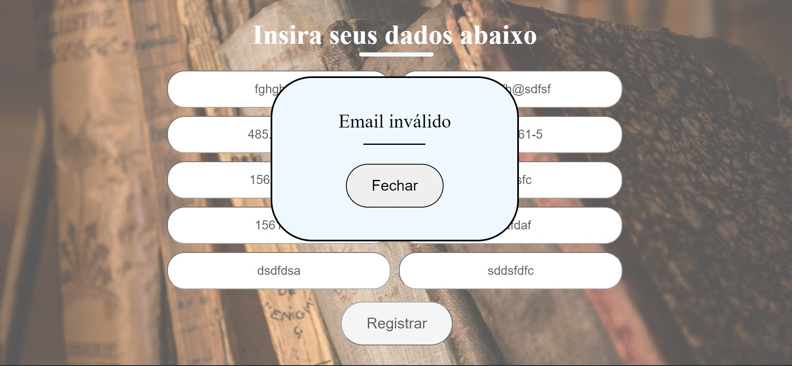
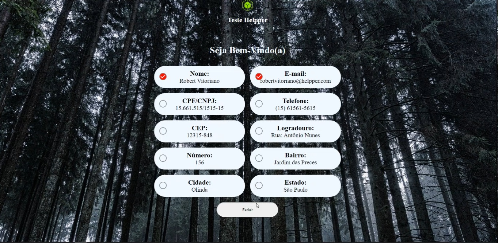
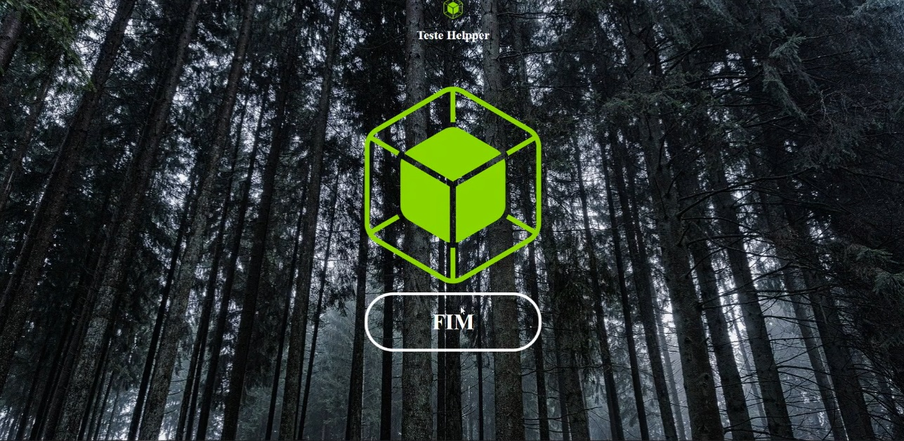

Um cadastro básico feito em javascript

### Desenvolvimento

## Linhagens

 - Javascript

 ### Interfaces

 ### Cadastro

 ### Erro

 ### Listagem de informações

 ### sem informações restantes

### Aplicação em execução

 ### Mobile

  ### Cadastro

 ### Erro

 ### Listagem de informações

 ### sem informações restantes

## Frameworks, ambiente de execução e outros meios utilizados

   - node.js
   - React.js
   - express.js
   - MongoDB
   - Google Chrome

## Ferramentas utilizadas
 - Visual Studio code
 - Insomnia
 - Adobe XD
 - Photoshop
 - Insomnia

# Projeto em execução

 / 

# Como Executar esse projeto 

Para executar esse projeto, primeiramente você deve executar o comando #`npm install` com o terminal posicionado na pasta referente ao backend e depois no frontend.

Após isso, certifique-se que o mongodb esteja corretamente instalado na maquina e que o comando mongod esteja adicionado à variável de ambiente 'path' ou que o mongodb
esteja instalado como um serviço. Após essa verificação. execute

### ` npm run start` na pasta referente ao backend

### `npm run start`  na pasta referente ao frontend

Feito isso, a aplicação poderá ser visualizada no browser com o endereço :

### `http://localhost:3000`

Fontes:

### Imagens
 - Todas  as imagens de fundo utilizadas podem ser encontradas no `pixabay.com` nos seguintes endereços:
   
   - forest-2048742_1920.jpg https://pixabay.com/pt/photos/floresta-natureza-paisagem-registo-2048742/
   - Register background.jpg https://pixabay.com/pt/photos/livros-antigos-livro-antigo-436498/

 ### As imagens listadas  acima possuem licença gratuita para uso comercial ou não

### Logo
 - https://helpper.com.br/
   